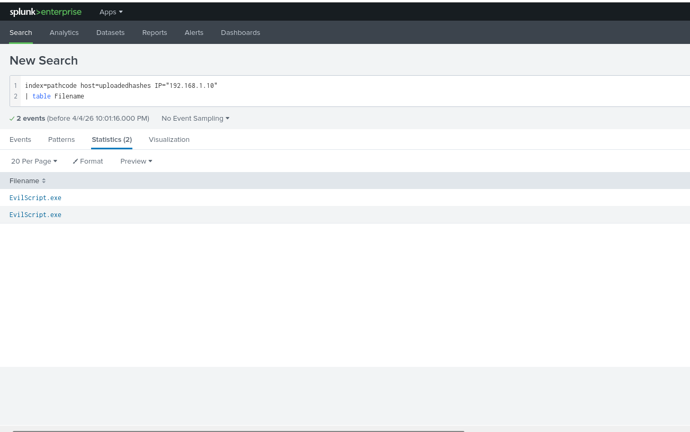

# SIEM Investigation: Detecting Malicious IP Activity

## 📌 Overview
This project demonstrates how I used a SIEM tool (Splunk) to investigate suspicious activity, identify a malicious IP address, and trace related events such as file execution.

The goal was to simulate a real-world security analysis workflow:
- Detect abnormal behavior
- Identify the source (malicious IP)
- Investigate associated actions (e.g., executable files)

---

## 🛠️ Tools & Technologies
- Splunk (SIEM)
- Log analysis
- Event correlation
- Basic search queries (SPL)

---

## 🔍 Investigation Steps

### 1. Initial Log Exploration
- Queried indexed logs to identify unusual or suspicious activity
- Focused on fields like:
  - `_time`
  - `user`
  - `IP`
  - `Filename`

---

### 2. Identifying the Malicious IP
- Filtered events to isolate suspicious IP behavior
- Looked for:
  - Repeated activity
  - Unusual access patterns
  - Unknown or external IP addresses

📷 Evidence:  

---

### 3. Tracing File Activity
- Investigated events tied to the identified IP
- Discovered execution of a suspicious `.exe` file

📷 Evidence:  

---

### 4. Correlation
- Linked the malicious IP to file execution events
- Confirmed potential compromise or malicious behavior

---

## 🚨 Key Findings
- A specific IP address was responsible for suspicious activity
- That IP was associated with execution of a potentially malicious executable file
- The behavior suggests unauthorized or harmful system interaction

---

## 🧠 What I Learned
- How to use Splunk to filter and analyze logs effectively
- How to identify indicators of compromise (IOCs)
- How to correlate events across logs to build a security narrative
- Importance of structured investigation in cybersecurity

---

## 📈 Future Improvements
- Automate detection using alerts
- Expand queries to detect similar patterns
- Integrate threat intelligence feeds for IP reputation checks

---

## 📬 Author
Daniel Williams  
Aspiring Cybersecurity Analyst
